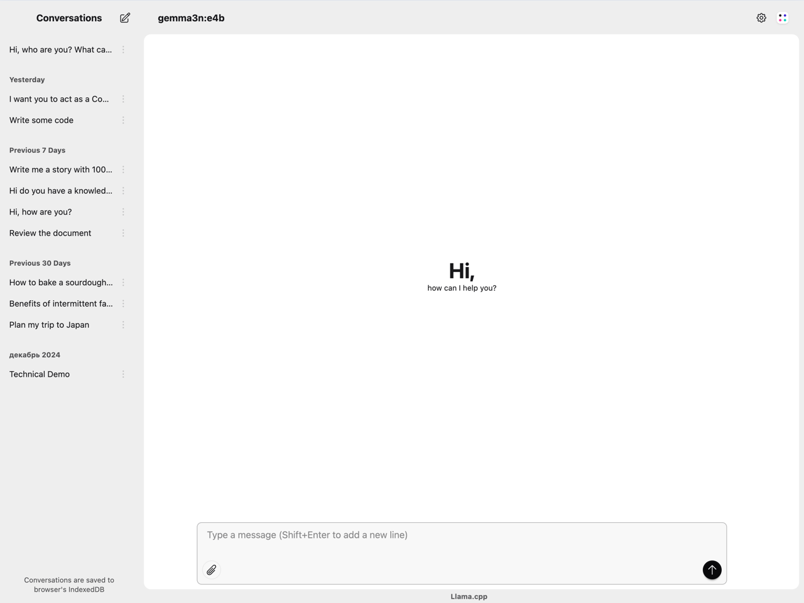

# 🦙 llama.ui - Minimal Interface for Local AI Companion ✨

**Tired of complex AI setups?** 😩 `llama.ui` is an open-source desktop application that provides a beautiful ✨, user-friendly interface for interacting with large language models (LLMs) powered by `llama.cpp`. Designed for simplicity and privacy 🔒, this project lets you chat with powerful quantized models on your local machine - no cloud required! 🚫☁️

## ⚡ TL;DR

This repository is a fork of [llama.cpp](https://github.com/ggml-org/llama.cpp) WebUI with:

- Fresh new styles 🎨
- Extra functionality ⚙️
- Smoother experience ✨



## 🌟 Key Features

1. **Multi-Provider Support**: Works with llama.cpp, LM Studio, Ollama, vLLM, OpenAI,.. and many more!

2. **Conversation Management**:
   - IndexedDB storage for conversations
   - Branching conversation support (edit messages while preserving history)
   - Import/export functionality

3. **Rich UI Components**:
   - Markdown rendering with syntax highlighting
   - LaTeX math support
   - File attachments (text, images, PDFs)
   - Theme customization with DaisyUI themes
   - Responsive design for mobile and desktop

4. **Advanced Features**:
   - PWA support with offline capabilities
   - Streaming responses with Server-Sent Events
   - Customizable generation parameters
   - Performance metrics display

5. **Privacy Focused**: All data is stored locally in your browser - no cloud required!

6. **Localized Interface**: Most popular language packs are included in the app, and you can choose the language at any time.

## 🚀 Getting Started in 60 Seconds!

### 💻 Standalone Mode (Zero Installation)

1. ✨ Open our [hosted UI instance](https://llama-ui.js.org/)
2. ⚙️ Click the gear icon → General settings
3. 🌐 Set "Base URL" to your local llama.cpp server (e.g. `http://localhost:8080`)
4. 🎉 Start chatting with your AI!

<details><summary><b>🔧 Need HTTPS magic for your local instance? Try this mitmproxy hack!</b></summary>
<p>

**Uh-oh!** Browsers block HTTP requests from HTTPS sites 😤. Since `llama.cpp` uses HTTP, we need a bridge 🌉. Enter [mitmproxy](https://www.mitmproxy.org/) - our traffic wizard! 🧙‍♂️

**Local setup:**

```bash
mitmdump -p 8443 --mode reverse:http://localhost:8080/
```

**Docker quickstart:**

```bash
docker run -it -p 8443:8443 mitmproxy/mitmproxy mitmdump -p 8443 --mode reverse:http://localhost:8080/
```

**Pro-tip with Docker Compose:**

```yml
services:
  mitmproxy:
    container_name: mitmproxy
    image: mitmproxy/mitmproxy:latest
    ports:
      - '8443:8443' # 🔁 Port magic happening here!
    command: mitmdump -p 8443 --mode reverse:http://localhost:8080/
    # ... (other config)
```

> ⚠️ **Certificate Tango Time!**
>
> 1. Visit http://localhost:8443
> 2. Click "Trust this certificate" 🤝
> 3. Restart 🦙 llama.ui page 🔄
> 4. Profit! 💸

**Voilà!** You've hacked the HTTPS barrier! 🎩✨

</p>
</details>

### 🖥️ Full Local Installation (Power User Edition)

1. 📦 Grab the latest release from our [releases page](https://github.com/olegshulyakov/llama.ui/releases)
2. 🗜️ Unpack the archive (feel that excitement! 🤩)
3. ⚡ Fire up your llama.cpp server:

**Linux/MacOS:**

```bash
./server --host 0.0.0.0 \
         --port 8080 \
         --path "/path/to/llama.ui" \
         -m models/llama-2-7b.Q4_0.gguf \
         --ctx-size 4096
```

**Windows:**

```bat
llama-server ^
             --host 0.0.0.0 ^
             --port 8080 ^
             --path "C:\path\to\llama.ui" ^
             -m models\mistral-7b.Q4_K_M.gguf ^
             --ctx-size 4096
```

4. 🌐 Visit http://localhost:8080 and meet your new AI buddy! 🤖❤️

## 🌟 Join Our Awesome Community!

**We're building something special together!** 🚀

- 🎯 **PRs are welcome!** (Seriously, we high-five every contribution! ✋)
- 🐛 **Bug squashing?** Yes please! 🧯
- 📚 **Documentation heroes** needed! 🦸
- ✨ **Make magic** with your commits! (Follow [Conventional Commits](https://www.conventionalcommits.org))

## 🛠️ Developer Wonderland

**Prerequisites:**

- 💻 macOS/Windows/Linux
- ⬢ [Node.js](https://nodejs.org/) >= 22
- 🦙 Local [llama.cpp server](https://github.com/ggml-org/llama.cpp/tree/master/tools/server) humming along

**Build the future:**

```bash
npm ci       # 📦 Grab dependencies
npm run build  # 🔨 Craft the magic
npm start    # 🎬 Launch dev server (http://localhost:5173) for live-coding bliss! 🔥
```

### 🏗️ Architecture

#### Core Technologies

- **Frontend**: [React](https://react.dev/) with [TypeScript](https://www.typescriptlang.org/)
- **Styling**: [Tailwind CSS](https://tailwindcss.com/docs/) + [DaisyUI](https://daisyui.com/)
- **State Management**: React Context API
- **Routing**: [React Router](https://reactrouter.com/)
- **Storage**: IndexedDB via [Dexie.js](https://dexie.org/)
- **Build Tool**: [Vite](https://vite.dev/)

#### Key Components

1. **App Context**: Manages global configuration and settings
2. **Inference Context**: Handles API communication with inference providers
3. **Message Context**: Manages conversation state and message generation
4. **Storage Utils**: IndexedDB operations and localStorage management
5. **Inference API**: HTTP client for communicating with inference servers

## 📜 License - Freedom First!

llama.ui is proudly **MIT licensed** - go build amazing things! 🚀 See [LICENSE](LICENSE) for details.

---

<p align="center">
Made with ❤️ and ☕ by humans who believe in private AI
</p>
